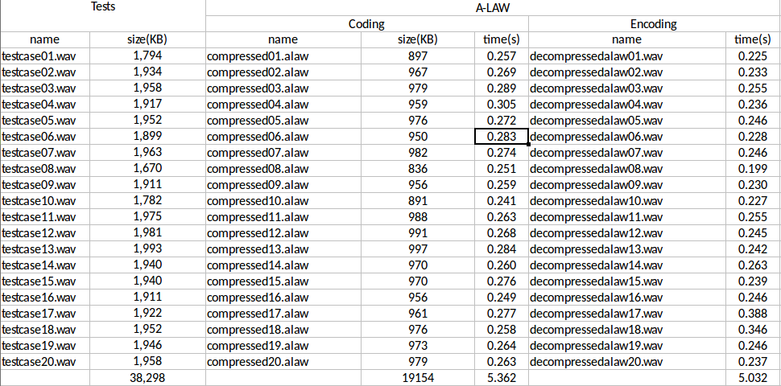
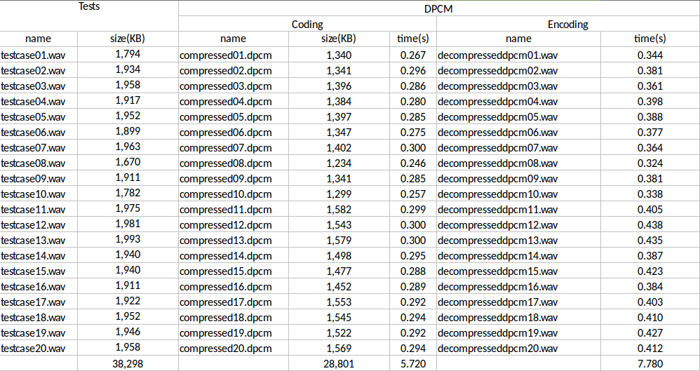
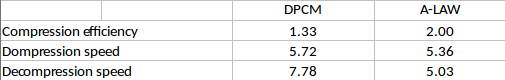

# Compresion-Algorithms

Comparision of standard companding algorithms
  1. A-law (https://en.wikipedia.org/wiki/A-law_algorithm)
  2. Adaptive DPCM using Huffman (https://en.wikipedia.org/wiki/Adaptive_differential_pulse-code_modulation)

## Tools
* Programming Language C (https://en.wikipedia.org/wiki/C_(programming_language))
* Code::Blocks IDE (http://www.codeblocks.org/)

## Steps 
* Recorder 20 wav files (https://en.wikipedia.org/wiki/WAV)
* Compression of each file ( with both algorithms, new files stored with algo extensions)
* Decompression of each compressed file

## Measurements
### A-Law 

  

### DPCM 

  

## Results

  

## Conclusion
DPCM algorithm has better quality of sound after decompressing. 
